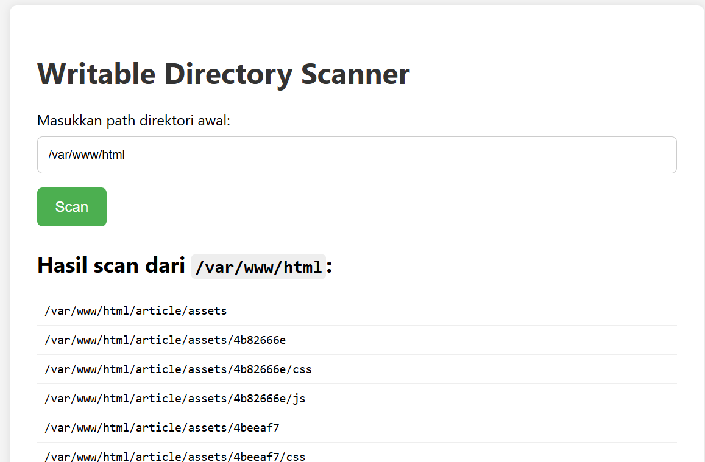

# Writable Directory Scanner

A simple PHP tool to recursively scan directories starting from a given path and list all writable ("green") folders — useful for auditing uploadable or insecure folders on web servers.

## 📌 Features

- Input any base directory (e.g., `/var/www/html`)
- Recursively scans all subdirectories
- Lists only writable folders (uploadable directories)
- Clean, modern UI with no external dependencies
- Easy to use in local or test environments

## ⚠️ Disclaimer

> **This tool is intended for testing or internal use only.**
>
> Do **not** expose this tool on public servers. It can be misused to gather information about your server's file system.

---

## 🔧 Requirements

- PHP 5.6 or higher (recommended: PHP 7+)
- A web server (Apache, Nginx, etc.) or PHP built-in server

---

## 🚀 How to Use

### 1. Clone/Download the Tools

```bash
curl -O https://raw.githubusercontent.com/JawaTengahXploit1337/Writable-Dir-Scanner/main/scanner.php # (add css)
wget https://raw.githubusercontent.com/JawaTengahXploit1337/Writable-Dir-Scanner/main/dir.php # (simple no css)
```


## 2. Run with PHP built-in server (optional)

php -S localhost:8000
Then open: http://localhost:8000/scanner.php / http://yourweb.com/scanner.php
```bash
http://localhost:8000/scanner.php for the modern UI version.
http://localhost:8000/dir.php for the simple version.
```
## 3. Or deploy on your local web server
Place scanner.php in your web root (e.g. /var/www/html/scanner.php) and access it via browser:

🖼 Screenshot
  

## 📂 Example Output
When you input /var/www/html, the tool might return:
```bash
/var/www/html/uploads
/var/www/html/public/images
/var/www/html/tmp
```
## 🛡 Security Notice
Do not use this tool in production environments.

This tool reads file system permissions — make sure it is restricted to trusted users only.
